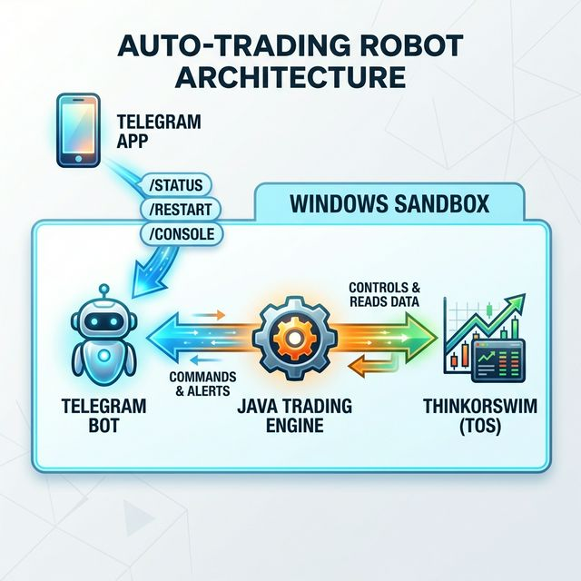
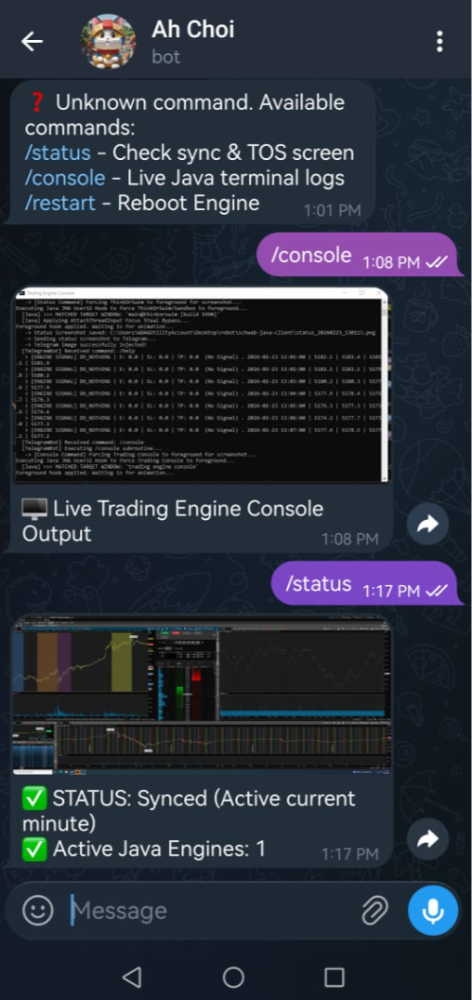

# ThinkOrSwim Auto‑Trading Robot

## Overview
This repository contains a Windows‑based automation suite that drives the ThinkOrSwim (TOS) platform via a Java bot, JNA window‑handling, and a PowerShell launcher.  The bot can:
- Execute trades based on a custom strategy.
- Capture live console screenshots (`/console` command).
- Report status and active Java engine instances (`/status`).
- Restart safely with a 60‑second delayed status check (`/restart`).
- Automatically refresh the Schwab OAuth token if it will expire within 24 hours.



## Directory Layout
```
.
├─ Launch‑TradingRobot.ps1      # Master launcher, token‑refresh logic
├─ auth_helper.py               # Python helper that performs Schwab OAuth
├─ schwab-java-client/          # Java source (Telegram bot, TradeExecutor, etc.)
├─ goal.md                      # Project goals (for reference)
└─ README.md                    # **This file**
```

## Prerequisites
- Windows 10/11 with PowerShell 5+.
- Java 17 (or compatible JDK) and Maven.
- Python 3.9+ with required packages (`requests`, `pywin32`).
- Schwab API credentials (client ID/secret) for `auth_helper.py`.

## Quick Start
1. **Install dependencies**
   ```powershell
   # Python packages
   pip install -r requirements.txt   # if a requirements file exists
   # Java build
   cd schwab-java-client
   mvn clean package
   ```
2. **Configure credentials** – create a `.env` file in the project root:
   ```text
   TOS_USERNAME=your_tos_username
   TOS_PASSWORD=your_tos_password
   SCHWAB_CLIENT_ID=your_schwab_client_id
   SCHWAB_CLIENT_SECRET=your_schwab_client_secret
   ```
   The file is ignored via `.gitignore` so it never gets committed.
3. **Run the launcher**
   ```cmd
   start_robot.bat
   ```
   The script will:
   - Check `schwab_tokens.json` for expiry and refresh if needed.
   - Start the Java JAR with the supplied TOS credentials.
   - Open the PowerShell console titled **"Trading Engine Console"** for `/console` screenshots.

## Telegram Bot Commands
| Command | Description |
|---------|-------------|
| `/status` | Check sync & TOS screen |
| `/console`| Live Java terminal logs |
| `/restart`| Reboot Engine |



## Token Refresh Logic (PowerShell)
The launcher reads `schwab_tokens.json`. If the `access_token_expires_at` timestamp is less than 24 hours from now, it automatically runs `auth_helper.py` to obtain a fresh token before launching the Java engine.


## License
MIT – see `LICENSE` file (if present).

---
*Generated by Antigravity – a powerful AI coding assistant.*
